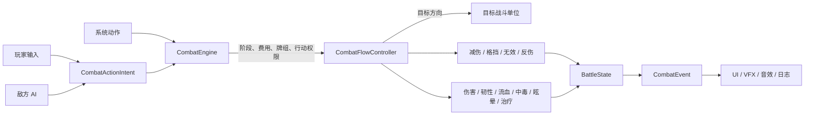

# 统一战斗流架构

更新时间：2026-08-04

## 1. 目标

玩家和敌人都是战斗单位，区别只在于谁产生行动：

- 玩家：由 UI/输入产生行动意图；
- 敌人：由 AI 产生行动意图；
- 系统：大招、处决、持续状态等产生系统行动。

行动产生后，不允许各自直接修改生命、韧性或状态。所有信息统一流经 `CombatFlowController`，再写入目标状态并发出表现事件。



## 2. 核心类型

### CombatActionIntent

文件：`Assets/Script/Combat/Core/CombatFlowController.cs`

统一描述一次出牌请求：

- `ActorId`：行动发起者；
- `CardInstanceId`：卡牌实例；
- `TargetId`：期望目标；
- `Origin`：PlayerInput、EnemyAI 或 System；
- `CardSource`：普通手牌或特殊牌。

玩家和 AI 不再拥有不同的效果结算入口，只负责构造不同来源的 Intent。

### CombatEngine

职责是编排，不直接结算伤害：

- 验证阶段和行动来源；
- 查找发起者、牌组、卡牌与目标；
- 通过行动授权闸门处理眩晕/跳过；
- 支付行动点或玩家魔法值；
- 处理手牌、弃牌、特殊牌次数和敌人出牌限制；
- 调用 `CombatFlowController`；
- 处理玩家大招进度、胜负和返回阶段；
- 按顺序派发事件。

统一入口：

```csharp
CombatResult SubmitCardAction(CombatActionIntent intent)
```

兼容入口 `PlayCard`、`PlayEnemyCard` 和 `PlayEnemySpecialCard` 都只负责创建 Intent，并立即委托给统一入口。

### CombatFlowController

唯一负责效果和数值流向的中枢：

- 普通卡牌效果；
- 敌方特殊牌；
- 固定攻击；
- 枪械逐发/连发伤害；
- 大招；
- 处决；
- 流血/中毒 tick；
- 抽牌事件；
- 减伤、格挡、无效、反伤；
- 生命、韧性、治疗、死亡与对应事件。

## 3. 流程顺序

一次普通卡牌行动按以下顺序执行：

1. 输入或 AI 产生 `CombatActionIntent`。
2. 引擎验证发起者是否有权控制该战斗单位。
3. 验证当前阶段、卡牌来源、目标、费用和出牌限制。
4. 敌方行动经过一次性回合授权闸门：
   - 整体跳过；
   - 眩晕；
   - 已在本回合被阻止；
   - 已被授权，可连续按规则出牌。
5. 支付行动点或魔法值。
6. 发送 `CardPlayed`。
7. 进入 `CombatFlowController.ResolveCard`。
8. 若为敌对行动，先处理目标的攻击无效次数。
9. 按 JSON 顺序处理每个效果。
10. 所有伤害统一处理减伤、格挡、死亡事件。
11. 韧性击破时统一发送事件；玩家击破敌人时处理返蓝和自动处决。
12. 行动结束时统一处理反伤。
13. 卡牌进入弃牌堆或标记特殊牌已使用。
14. 玩家耗蓝时检查自动大招。
15. 检查胜负并返回正确阶段。

## 4. 双向规则

下列规则现在对玩家和敌人使用同一套实现：

| 规则 | 来源与目标 |
|---|---|
| 普通伤害/多段伤害 | 任意发起者 → 对立目标 |
| 韧性伤害 | 任意发起者 → 对立目标 |
| 流血/中毒 | 任意发起者 → 对立目标 |
| 眩晕 | 任意发起者 → 对立目标 |
| 格挡/减伤/无效/反伤 | 效果发起者 → 自身 |
| 吸血 | 对目标造成实际伤害后 → 治疗发起者 |
| 抽牌/获得行动点 | 发起者 → 自己的牌组/资源 |
| 持续状态 tick | 系统 → 状态持有者 |
| 死亡与胜负 | 中枢写入后 → 引擎统一检查 |

减伤持续时间在对应战斗单位的下一次同侧回合开始时推进。玩家和敌人都可能因眩晕或对手的跳过效果失去整个回合。

## 5. 有意保留的差异

共用流不等于双方所有资源完全相同：

- 玩家由输入控制，敌人由 AI 控制；
- 玩家拥有魔法值、强化和自动大招进度；
- 敌人当前主要使用行动点、分级出牌限制和特殊牌回合；
- 60 点处决目前只由玩家击破敌方韧性触发；
- 胜利条件仍是所有敌人死亡，失败条件仍是玩家死亡。

这些差异由 `CombatEngine` 的编排策略表达，不允许复制一套新的伤害/状态实现。

## 6. 扩展新效果的方法

新增效果时：

1. 在 `CardEffectType` 增加类型。
2. 在 JSON Repository 中加入字符串映射。
3. 判断它是敌对目标还是自身目标，并更新目标推断。
4. 只在 `CombatFlowController.ResolveEffect` 中实现一次。
5. 使用中枢的伤害、韧性、治疗和状态事件方法。
6. 同时增加“玩家使用”和“敌人使用”的方向测试。
7. 不要在 UI、AI、Presenter 或 `BattleController` 中直接修改战斗状态。

## 7. 架构不变量

运行时代码应持续满足：

- `CombatEngine` 之外不推进阶段和胜负；
- `CombatFlowController` 之外不直接调用 `ApplyDamage`、`ReduceToughness`、`AddBleedStacks`、`AddPoisonStacks`、`AddBlockPoints`、`AddReflectDamage` 等状态修改方法；
- AI 只决定“出哪张牌”，不计算实际伤害；
- UI 只提交 Intent 和消费事件；
- 普通牌、特殊牌、固定攻击和系统伤害必须产生统一事件；
- 任何能阻止行动的状态必须在统一授权闸门生效，不能依赖 AI 自觉调用前置检查。

## 8. Manifest 编码修复

`manifest.json` 原本是合法的无 BOM UTF-8；旧版 Windows PowerShell 会按系统代码页误读中文字段，看起来像乱码和缺少引号。

现在两个中文来源字段使用标准 `\uXXXX` 转义，文件变为纯 ASCII：

- 默认 PowerShell 可以直接 `ConvertFrom-Json`；
- 项目自定义 `SimpleJsonParser` 会还原正确中文；
- 54 个定义、76 份 copies、12 张敌方牌和 7 个分类保持不变。

## 9. 验证

本轮验证结果：

- `KiKs.Combat` 编译通过；
- `KiKs.Combat.Tests` 编译通过；
- 使用 Unity Mono 对纯战斗测试进行实际反射执行：28 个通过，0 个失败；
- 新覆盖包括：
  - 玩家/敌人共用减伤与格挡；
  - 双向流血；
  - 敌方自身增益；
  - 双向攻击无效与反伤；
  - 直接调用不能绕过敌方眩晕；
  - 敌方眩晕牌能跳过玩家回合；
  - 错误控制来源会被拒绝；
- 使用项目自己的 `CardJsonRepository` 完整加载数据：
  - 54 个定义；
  - 76 份 copies；
  - 12 张敌方牌；
  - BigEye 特殊牌识别成功。
