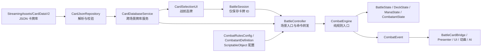

# E1 项目代码结构说明

> 文档基于 2026-07-18 的仓库内容整理，描述当前代码与场景的实际结构。后续如果调整目录、场景挂载或战斗规则，请同步更新本文档。

## 1. 项目概览

这是一个使用 Unity 6 开发的 2D 卡牌回合制战斗项目。目前已形成“JSON 卡牌数据 → 纯 C# 战斗规则 → Unity 场景接入 → UI/动画表现”的分层结构。

主要技术与版本：

- Unity：`6000.3.12f1`
- 渲染：Universal Render Pipeline 17.3.0，使用 2D Renderer
- 输入：Unity Input System 1.19.0
- UI：UGUI、TextMesh Pro
- 动画：DOTween（插件位于 `Assets/Plugins/Demigiant/DOTween`）
- 测试：Unity Test Framework 1.6.0，当前使用 EditMode 测试
- 主要命名空间：`KiKs.Combat`、`KiKs.UI`

核心设计原则：

1. 卡牌静态数据以 JSON 为唯一来源，不为每张牌创建 ScriptableObject。
2. `CombatEngine` 是推进战斗规则的统一入口，UI 不直接修改战斗状态。
3. 规则层产生 `CombatEvent`，场景表现层消费事件并刷新 UI、动画和反馈。
4. `CardSpec` 表示不可变的卡牌定义，`CardInstance` 表示单场战斗中的一张实体牌。

## 2. 顶层目录

```text
E1/
├─ Assets/
│  ├─ Art/                       美术资源
│  ├─ Data/Combat/               当前使用的战斗配置资源
│  ├─ Docs/                      既有战斗设计与配置文档
│  ├─ Plugins/                   第三方插件（当前主要为 DOTween）
│  ├─ Prefabs/                   卡牌 Prefab
│  ├─ Scenes/                    Cafe、PreBattle、Card 三个场景
│  ├─ Script/                    项目 C# 代码
│  ├─ Settings/                  URP、场景模板及 PlayTime 配置资源
│  ├─ StreamingAssets/CardDataV2/  JSON 卡牌库（V2）及 Schema
│  ├─ Tests/                     EditMode 自动化测试
│  └─ TextMesh Pro/              TMP 默认资源
├─ Packages/                     Unity Package Manager 配置
├─ ProjectSettings/              Unity 项目设置与构建场景列表
├─ UserSettings/                 本机 Unity 用户设置
├─ Library/、Temp/、Logs/、obj/  Unity/IDE 生成目录，不应手动维护
└─ E1.sln、*.csproj              Unity 生成的 IDE 工程文件
```

日常开发主要关注 `Assets/Script`、`Assets/StreamingAssets/CardDataV2`、`Assets/Data/Combat`、`Assets/Prefabs`、`Assets/Scenes` 和 `Assets/Tests`。`Library`、`Temp`、`obj` 及自动生成的 `.csproj` 不属于业务源码。

## 3. 总体架构与依赖方向



依赖方向应保持为：

```text
场景与表现层 → Runtime 接入层 → Core 规则层
                      ↑
              Data 数据与配置层
```

`Core` 中除基础类型外不依赖具体场景对象；场景脚本通过 `BattleController` 调用引擎，再通过事件读取结果。新增功能时应尽量沿用这个方向，避免让 `CombatEngine` 反向引用 UI、Prefab 或场景对象。

## 4. `Assets/Script` 代码结构

### 4.1 `Combat/Core`：战斗领域与纯规则

| 文件 | 职责 |
| --- | --- |
| `CombatTypes.cs` | 定义战斗阶段、阵营、敌人等级、卡牌资源、效果类型、事件类型等枚举。 |
| `CardEffectSpec.cs` | 表示一条 V2 卡牌效果（类型、数值、段数、单位、倍率）；`UpgradeableNumber` 保存基础值和强化值。 |
| `CardSpec.cs` | 从 JSON 得到的不可变卡牌定义，包括名称、分类、费用、目标和效果列表。 |
| `CardInstance.cs` | 单场战斗中的实体牌，具有唯一 `InstanceId` 和本场强化状态。 |
| `DeckState.cs` | 管理抽牌堆、手牌、弃牌堆、洗牌、抽牌、手牌上限和弃牌。 |
| `ManaState.cs` | 管理当前魔法点、本回合消耗、魔法牌次数和大招累计进度。 |
| `CombatantState.cs` | 管理角色生命、韧性、行动点、眩晕、流血/中毒层数、减伤、攻击无效和跳过敌方回合等状态，以及统一的持续状态 tick 系统。 |
| `BattleState.cs` | 聚合一场战斗的规则、玩家、敌人、牌堆、魔法点、阶段、回合和处决等待状态。 |
| `CombatRules.cs` | 从 Unity 配置复制得到的不可变运行时规则快照。 |
| `CombatEvent.cs` | 定义规则层输出的不可变事件，以及一次命令的 `CombatResult`。 |
| `CombatEngine.cs` | 校验命令、修改 `BattleState`、处理效果并按顺序发出事件，是规则推进的唯一入口。 |

`CombatEngine` 当前公开的主要命令：

```csharp
StartBattle();
PlayCard(cardInstanceId, targetId);
UpgradeCard(cardInstanceId, preferredUltimateTargetId);
ConfirmExecution();
EndPlayerTurn();
ResolveEnemyAttack(enemyId, damage);
CompleteEnemyTurn();
```

规则层状态机大致如下：

```text
NotStarted
  → PlayerTurnStart
  → PlayerInput
  → ResolvingCard
  → PlayerInput 或 AwaitingExecutionConfirmation
  → PlayerTurnEnd
  → EnemyTurn
  → 下一次 PlayerTurnStart
  → Victory / Defeat
```

### 4.2 `Combat/Data`：JSON 与 Unity 配置

| 文件 | 职责 |
| --- | --- |
| `SimpleJsonParser.cs` | 项目内置的轻量 JSON 解析器，不依赖 Newtonsoft.Json。 |
| `CardJsonRepository.cs` | 读取 manifest 和分类文件，校验版本、分类、数量、重复 ID、费用与效果字段，并提供卡牌查询。 |
| `CombatRulesConfig.cs` | 可在 Inspector 编辑的全局战斗规则 ScriptableObject，运行时生成 `CombatRules`。 |
| `CombatantDefinition.cs` | 玩家/敌人的静态属性 ScriptableObject，运行时生成 `CombatantState`。 |

ScriptableObject 的创建菜单：

```text
Create → KiKs → Combat → Combat Rules
Create → KiKs → Combat → Combatant Definition
```

当前项目中的对应资源主要位于：

- `Assets/Data/Combat/DefaultRules.asset`
- `Assets/Data/Combat/Player.asset`
- `Assets/Data/Combat/Enemy_Minion.asset`

`Assets/Settings/PlayTime` 下还保留了一组 PlayTime 配置资源，修改数值前应先确认目标场景实际引用的是哪一组资源。

### 4.3 `Combat/Runtime`：Unity 场景接入与表现桥接

| 文件 | 职责 |
| --- | --- |
| `CardDatabaseService.cs` | 异步加载 `StreamingAssets/CardData`，保存共享牌库；可使用 `DontDestroyOnLoad` 跨场景保留。 |
| `BattleSession.cs` | 在选牌场景与战斗场景之间传递卡牌 ID 列表；允许重复 ID，不保存强化状态。 |
| `BattleController.cs` | 战斗场景入口。创建实体牌、角色状态、`BattleState` 和 `CombatEngine`，向 Unity 层暴露命令与事件。 |
| `BattleCardBridge.cs` | 连接规则层手牌与 `CardDealAnimator`，处理初始发牌、出牌、回收和新回合发牌及状态 tick。 |
| `CardDealAnimator.cs` | 实例化卡牌 Prefab，维护手牌视图列表，播放发牌、排布和弃牌动画。 |
| `CardView.cs` | 保存视图对应的 `CardSpec`/`InstanceId`，识别点击或上拖出牌，播放抽牌/弃牌动画。 |
| `CardDragBridge.cs` | 将 Unity 拖拽事件转发给 `CardView`；实际位移可由 `KiKs.UI.Draggable` 负责。 |
| `BattleEventPresenter.cs` | 监听 `CombatEventRaised`，从最终 `BattleState` 刷新玩家/敌人的生命、韧性、行动点和魔法点 UI。 |
| `SimpleEnemyAI.cs` | 当前测试用敌人 AI：玩家行动点耗尽后自动结束回合，敌人使用固定 20 点伤害的普通攻击。 |
| `EnemyHitFeedbackNew.cs` | 监听受伤结果并播放敌人击退、震动、闪色等 DOTween 表现。 |
| `CardDealTest.cs` | 发牌表现的调试入口，当前仍挂在 `Card` 场景中。 |

### 4.4 `Combat/PreBattle`：战前选牌

`CardSelectionUI.cs` 完成以下工作：

1. 等待 `CardDatabaseService` 加载牌库；
2. 从 `Repository.Cards` 生成可选卡牌列表；
3. 根据 `CombatRulesConfig.ExpectedInitialDeckSize` 限制牌组数量，缺省为 15；
4. 支持重复选择和撤销最后一次选择；
5. 将最终卡牌 ID 写入 `BattleSession`；
6. 异步加载 `Card` 战斗场景。

该层只选择 `CardSpec.Id`，不创建 `CardInstance`。同名牌的唯一实例 ID 由 `BattleController` 在进入战斗后按 `卡牌ID#序号` 生成。

### 4.5 `CombatTemp`：当前临时 UI 适配

| 文件 | 职责 |
| --- | --- |
| `PlayerHealthBarUI.cs` | 从 `BattleController.State` 读取并显示玩家生命。 |
| `CombatResourceTextUI.cs` | 显示玩家行动点和当前魔法点。 |

该目录目前并不包含战斗规则，只是与现有场景 UI 对接的适配代码。后续 UI 稳定后，可将其合并到 `Combat/Runtime/Presentation` 等更明确的目录。

### 4.6 `UI`：通用卡牌交互

| 文件 | 职责 |
| --- | --- |
| `Draggable.cs` | 通用 UGUI 拖拽、轴向约束和结束回弹。 |
| `CardInteraction.cs` | 卡牌悬停、按下、发光、缩放等 DOTween 交互效果。 |
| `CardSkew.cs` | 通过修改 UI Mesh 实现卡牌倾斜效果。 |

`Card_Battle.prefab` 在 `Card1.prefab` 的基础上增加了 `CardView` 和 `CardDragBridge`，是 `CardDealAnimator` 当前使用的战斗卡牌 Prefab。

### 4.7 `Input`

`InputSystem_Actions.cs` 由 `Assets/Settings/InputSystem_Actions.inputactions` 自动生成。输入映射应优先在 `.inputactions` 资源中编辑，不要直接长期维护生成的 C# 文件。

## 5. 场景结构与启动流程

构建场景顺序记录在 `ProjectSettings/EditorBuildSettings.asset`：

1. `Assets/Scenes/Cafe.unity`
2. `Assets/Scenes/PreBattle.unity`
3. `Assets/Scenes/Card.unity`

### `Cafe`

当前主要包含相机和 2D 全局光，没有挂载项目业务脚本，可视为尚待扩展的前置场景。

### `PreBattle`

实际挂载的项目脚本：

- `CardDatabaseService`
- `CardSelectionUI`

正常流程是先在此处加载 8 张卡牌（V2），选择规定数量的牌，然后进入 `Card`。

### `Card`

实际挂载的核心项目脚本包括：

- `CardDatabaseService`
- `BattleController`
- `SimpleEnemyAI`
- `CardDealAnimator`
- `BattleCardBridge`
- `BattleEventPresenter`
- `EnemyHitFeedbackNew`
- `PlayerHealthBarUI`
- `CombatResourceTextUI`
- `CardDealTest`
- `Draggable`

`PreBattle` 中的 `CardDatabaseService` 默认跨场景保留；进入 `Card` 后，场景中的重复服务会被单例逻辑销毁。若直接从 `Card` 场景进入 Play Mode，则使用 `Card` 自己的服务和 `BattleController.debugStartingCardIds` 启动。

## 6. 关键运行数据流

### 6.1 卡牌数据加载

```text
CardDatabaseService.Awake
  → EnsureLoaded
  → 读取 manifest.json
  → 依次读取 4 个分类 JSON（melee/ranged/magic/defense）
  → CardJsonRepository.Load
  → 解析并完整校验
  → 生成 IReadOnlyList<CardSpec>
```

牌库位于 `Assets/StreamingAssets/CardDataV2`：

| 分类 | 文件 | 数量 |
| --- | --- | ---: |
| 近战 | `melee.json` | 2 |
| 射击 | `ranged.json` | 2 |
| 魔法 | `magic.json` | 2 |
| 防御 | `defense.json` | 2 |
| 合计 |  | 8 |

`manifest.json` 保存版本、文件列表和数量，`card-data.schema.json` 描述完整数据格式。运行时仓库还会检查分类一致性、总数、重复 ID 和支持的枚举值。

### 6.2 选牌到开战

```text
CardSelectionUI 选择 15 个 CardSpec.Id
  → BattleSession.SetSelectedDeck
  → 加载 Card 场景
  → BattleController.InitializeBattle
  → 每个 ID 转成独立 CardInstance
  → 创建 DeckState、BattleState、CombatEngine
  → CombatEngine.StartBattle
  → 恢复行动点并抽取首轮手牌
```

### 6.3 出牌与表现

```text
CardView 点击或上拖
  → CardDealAnimator.OnCardPlayed
  → BattleCardBridge.OnCardPlayed
  → BattleController.PlayCard(instanceId, targetId)
  → CombatEngine 校验费用、目标和阶段
  → 修改状态并返回 CombatResult
  → 逐条广播 CombatEvent
  → Presenter / 反馈脚本刷新表现
  → 成功则卡牌飞入弃牌区，失败则回到手牌位置
```

同名牌可能存在多张，因此战斗 UI 必须传递 `CardInstance.InstanceId`，不能只传 `CardSpec.Id`。

### 6.4 回合循环

玩家回合开始时：

- 回合数加一；
- 处理所有敌人持续状态 tick（流血等）并检查死亡；
- 重置本回合魔法消耗与魔法牌次数；
- 推进玩家持续状态（减伤等）；
- 恢复行动点；
- 按规则抽牌并处理洗牌、手牌溢出；
- 进入 `PlayerInput`。

玩家结束回合时，未使用手牌全部进入弃牌堆，然后进入敌方回合。`SimpleEnemyAI` 当前负责一次固定伤害攻击并调用 `CompleteEnemyTurn` 开始下一回合。

## 7. 状态所有权与调用约定

为避免出现“UI 数值和规则数值不一致”，建议严格遵循以下边界：

- `BattleState` 及其子状态是单场战斗的真实数据源。
- 只有 `CombatEngine` 负责正式推进规则和战斗阶段。
- Unity 脚本通过 `BattleController` 的公开方法提交命令。
- UI/动画监听 `CombatEventRaised`，并在需要最终数值时重新读取 `BattleController.State`。
- 卡牌 JSON 与 `CardSpec` 是静态定义，战斗强化只写在 `CardInstance.IsUpgraded`。
- `BattleSession` 只保存跨场景所需的卡牌 ID，不应逐渐演变为完整战斗状态容器。

常用读取与命令入口：

```csharp
// 牌库
cardDatabase.Repository.Cards;
cardDatabase.Repository.GetRequiredCard(cardId);

// 战前选择
BattleSession.SetSelectedDeck(selectedCardIds);

// 战斗命令
battleController.PlayCard(instanceId, targetId);
battleController.UpgradeCard(instanceId, targetId);
battleController.ConfirmExecution();
battleController.EndPlayerTurn();

// 状态与事件
var state = battleController.State;
battleController.CombatEventRaised += OnCombatEvent;
```

## 8. 当前已实现与待完善规则

`CombatEngine` 已有专门结算逻辑的效果：

- 普通伤害、多段伤害
- 韧性伤害与破韧
- 处决（小兵即死、精英/Boss 扣 40 血+眩晕 1 回合）
- 眩晕
- 流血（叠层 + 每回合递减 tick）
- 暴风雪流血比例伤害
- 固定伤害吸血
- 反伤
- 格挡
- 攻击无效次数
- 百分比减伤与持续回合
- 跳过敌方回合
- 抽牌
- 按目标最大生命百分比吸血
- 获得行动点或魔法点
- 小怪/精英/Boss 的处决分支
- 战斗内强化、魔法点回合限额和自动大招

以下效果可以从 JSON 解析，但尚未完成专属规则；使用时会发出 `EffectNotImplemented`：

- `Bleed`（已完成）
- `Poison`
- `Vulnerability`
- `Immunity`
- `SummonCompanion`
- `PlayCardsFromDiscard`

此外还应注意：

- `SimpleEnemyAI` 的基础攻击伤害目前硬编码为 20，只适合当前原型。
- `CardDealTest` 和测试抽牌按钮仍存在于 `Card` 场景，发布版本前应决定是否保留。
- `BattleEventPresenter` 当前以“第一个存活敌人”刷新单敌人 UI，多敌人界面需要按敌人 ID 建立独立视图绑定。
- `CardView.Setup` 当前主要绑定数据和实例 ID；卡面文本、图片与效果描述的完整数据绑定仍可继续封装。
- `CardView.SyncCardInteraction` 通过 `CardInteraction.UpdateOrigin()` 公开方法同步内部状态，已消除反射依赖。

## 9. 测试结构

测试程序集位于 `Assets/Tests/EditMode/Combat`，通过 `KiKs.Combat.Tests.asmdef` 引用 `KiKs.Combat`：

| 文件 | 当前覆盖 |
| --- | --- |
| `CardJsonRepositoryTests.cs` | 真实 JSON 牌库可加载 8 张卡牌（V2），分类、强化值和固定值字段正确。 |
| `DeckStateTests.cs` | 抽牌、手牌上限、弃牌堆洗回抽牌堆。 |
| `CombatEngineTests.cs` | 开战抽牌、行动点、出牌弃牌、破韧与处决、回合切换、强化、魔法消耗限额、自动大招、行动点修正。 |

修改 `Core`、JSON 解析或卡牌数据后，至少应运行 Unity Test Runner 中的 EditMode 测试。涉及场景挂载、协程、Prefab 或动画的修改，目前还需要 Play Mode 手工检查；后续建议补充 PlayMode 测试。

## 10. 常见扩展方式

### 新增或修改卡牌

1. 在对应分类 JSON 中新增或修改卡牌；
2. 保证 `id` 全局唯一，分类与文件一致；
3. 更新分类文件和 `manifest.json` 中的 `cardCount`；
4. 必要时同步 `card-data.schema.json`；
5. 运行 `CardJsonRepositoryTests`；
6. 进入 Play Mode，确认 Console 显示加载 8 张（V2）或新的预期数量。

### 新增一种卡牌效果

1. 在 `CardEffectType` 增加枚举；
2. 在 `card-data.schema.json` 增加合法类型和字段约束；
3. 在 `CardJsonRepository` 增加解析与字段校验；
4. 在 `CardEffectSpec` 增加确有必要的数据；
5. 在 `CombatEngine.ResolveEffects` 增加结算分支；
6. 为规则行为和 JSON 解析补充 EditMode 测试；
7. 如需新表现，再增加对应 `CombatEventType`，由 Runtime/UI 消费。

### 新增敌人 AI

建议让 AI 只负责“决定做什么”，实际伤害、状态和阶段仍通过 `BattleController`/`CombatEngine` 结算。不要从 AI 脚本直接改写 `Player.CurrentHealth` 等状态。

### 新增 UI

优先监听 `BattleController.CombatEventRaised`，事件到达后从 `BattleController.State` 读取最终数值。多敌人 UI 应以 `CombatantState.Id` 为绑定键，不要依赖列表顺序或场景对象名称。

## 11. 相关文档

- `Assets/Docs/回合对战设计文档.md`：战斗规则与策划约定
- `Assets/Docs/JsonCardPipelineSetup.md`：JSON 卡牌接入与场景配置
- `Assets/Docs/CombatCodeResponsibilities.md`：战斗代码职责说明

本文档侧重“当前仓库整体结构和真实调用关系”；上面的文档分别侧重规则设计、配置步骤和战斗模块职责。
